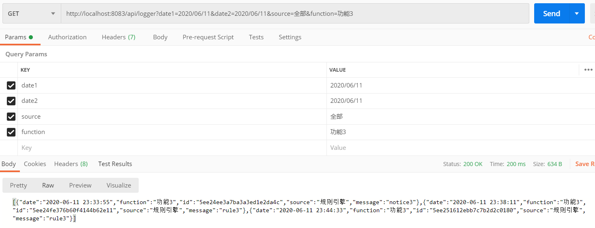

# 日志使用说明
## 1.码源位置
日志模块所需要导入的依赖包为：
   ```
    <dependency>
        <groupId>org.springframework.boot</groupId>
        <artifactId>spring-boot-starter-data-mongodb</artifactId>
    </dependency>
   ```
在application.yml文件中需要对数据库进行配置：
   ```
       data:
           mongodb:
             host: 127.0.0.1
             port: 27017
             database: edge

       jackson:              //规定日志中日期存储的格式，因为mongodb存储的是国际标准时间，因此需要转化为GMT+8
           date-format: yyyy-MM-dd HH:mm:ss
           time-zone: GMT+8
   ```
存入mongodb的文档形式为entity路径下定义的实体类Log（系统日志），以及实体类Logger（应用日志）。
在service路径下创建了LogService、LoggerService接口，用来定义日志的写和查功能，
其具体实现在service下Impl路径下的LogServiceImpl、LoggerServiceImpl文件中。
## 2.Log实体类说明
在实体类中，开头的注释表明日记记录在mongodb中edge数据库下的log集合中，如下
```
@Document(collection = "log")    //系统日志数据集合
@Document(collection = "logger")   //应用日志数据集合

```
具体定义的key值有id号、类别/功能（分类查找用）、日志内容、创建日期和所属微服务（将来可视情况进行增删）
```
//系统日志
@Id
    private String id;
    private String category;
    private String massage;
    private Date data;
    private String source;
//应用日志
@Id
    private String id;
    private String function;
    private String massage;
    private Date data;
    private String source;
```
## 3.日志功能说明
在LogService接口中，定义了写系统日志的四种类型debug、info、warn、error以及一种查询日志的方式：
```
    public void debug(String message);
    public void info(String message);
    public void warn(String message);
    public void error(String message);
    JSONArray find(Date date1,Date date2,String source,String category);
```
在LoggerService接口中，定义了写应用日志的四种类型功能1、功能2、功能3、功能4以及一种查询日志的方式：
```
    void function1(String message);
    void function2(String message);
    void function3(String message);
    void function4(String message);
    JSONArray find(Date date1, Date date2, String source, String function);
```
## 4.日志实现说明
对mongodb进行读取和写入操作需要定义一个mongo的临时变量：
```
 @Autowired
    private MongoTemplate mongoTemplate;
```
## 5.写日志使用示例
先在要写或读取日志的位置进行如下声明：
```
 @Autowired
   LogService logService;
```
写日志时，可以选择一种日志的类别，然后调用其函数写（便于以后对日志进行分类输出），以info、和function1级别为例：
（在每种微服务中，均可以这种方式进行写操作）
```
 logService.info("请写入日志内容");
 loggerService.function1("请写入日志内容");
```
## 6. 前端查询需提供的参数
当查询日志时，前端需要给后端提供日期范围：起始日期date1（如2020/06/11），终止日期date2（如2020/06/11），
所属微服务source（如“规则引擎”，“全部”）。系统日志还要传入类别category（如“info”或“全部”），应用日志还要传入功能类别function（如“功能1”或“全部”）：
## 7. Get请求的api
查询日志可以调用ebos-rule微服务的接口。
```$xslt
查询系统日志接口：http://localhost:8083/api/log
查询应用日志接口：http://localhost:8083/api/logger
```
进行测试时，如果数据库没有数据，可调用如下接口写入日志（各个微服务均可调用，不用传参数）：
```$xslt
写日志（Post）查看数据库库所有日志（GET）：
应用日志：http://localhost:（微服务端口号）/api/loggertest
系统日志：http://localhost:（微服务端口号）/api/logtest
```
## 6.数据库查看日志
可通过mongodb的相关可视化软件，在输入IP地址：127.0.0.1，port：27017后，在edge数据库中的log集合和logger集合内查看记录的日志数据。
## 7.输出日志的形式
通过findA（）函数调用日志内容时，传参形式和日志呈现的内容如下：
