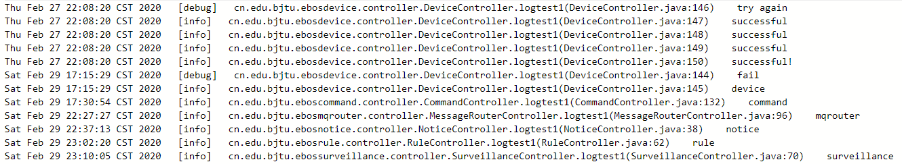

# 日志使用说明
## 1.码源位置
日志模块所需要导入的依赖包为：
   ```
    <dependency>
        <groupId>org.springframework.boot</groupId>
        <artifactId>spring-boot-starter-data-mongodb</artifactId>
    </dependency>
   ```
在application.yml文件中需要对数据库进行配置：
   ```
       data:
           mongodb:
             host: 127.0.0.1
             port: 27017
             database: edge
   ```
存入mongodb的文档形式为entity路径下定义的实体类Log，
在service路径下创建了LogService接口，用来定义日志的写和查功能，
其具体实现在service下Impl路径下的LogServiceImpl文件中。
## 2.Log实体类说明
在log实体类中，开头的注释表明日记记录在mongodb中edge数据库下的log集合中，如下
```
@Document(collection = "log")
```
具体定义的key值有id号、类别（分类查找用）、日志内容、创建日期和写日志的位置（将来可视前端呈现形式定义key值）
```
@Id
    private String id;
    private String category;
    private String massage;
    private Date data;
    private String source;
```
## 3.日志功能说明
在LogService接口中，定义了写日志的四种类型debug、info、warn、error以及两种调用日志的方式：
```
public void debug(String message);
    public void info(String message);
    public void warn(String message);
    public void error(String message);
    public String findLogByCategory(String category);
    public String findAll();
```
## 4.日志实现说明
在LogServiceImpl中，需要注意mongodb中存入的时间是国际标准时间，若将其转化成本地时间，需要加入注释如下：
```
 @JsonFormat(pattern = "yyyy-MM-dd HH:mm:ss" , timezone = "GMT+8")
```
对mongodb进行读取和写入操作需要定义一个mongo的临时变量：
```
 @Autowired
    private MongoTemplate mongoTemplate;
```
## 5.使用示例
先在要写或读取日志的位置进行如下声明：
```
 @Autowired
   LogService logService;
```
写日志时，可以选择一种日志的类别，然后调用其函数写（便于以后对日志进行分类输出），以info级别为例：
```
 logService.info("请写入日志内容");
```
当调用日志时，使用findAll（）函数可读取所有的日志内容，并将结果保存到字符串中，供前端调用，使用形式如下：
```
 String str=LogService.findAll();
```
当需要只调用出某一类日志的内容时，可使用findLogByCategory（）函数，以调用error类日志为例，使用形式如下：
```
String str= logService.findLogByCategory("error");
```
## 6.数据库查看日志
可通过mongodb的相关可视化软件，在输入IP地址：127.0.0.1，port：27017后，在edge数据库中的log集合内查看记录的日志数据。
## 7.输出日志的形式
通过findAll（）或findLogByCategory（）函数调用日志内容时，其呈现的内容如下：
