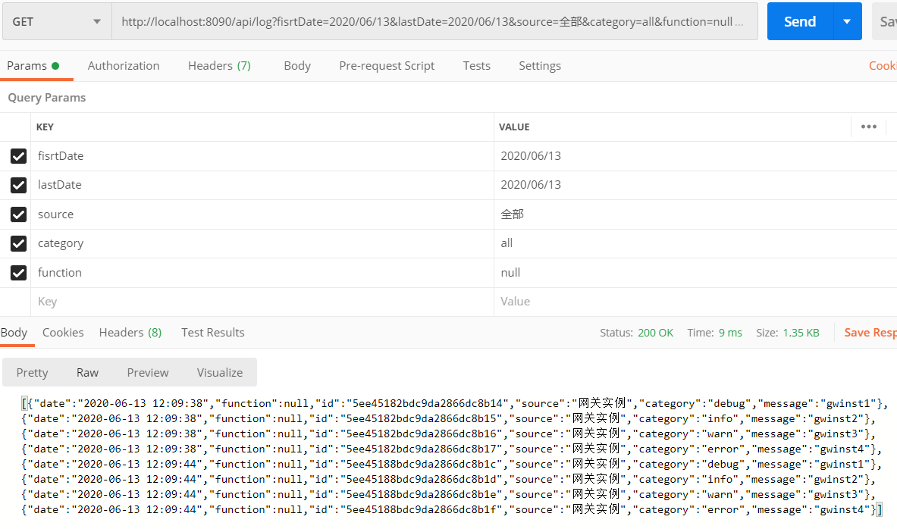

# 日志使用说明
## 1.码源位置
日志模块所需要导入的依赖包为：
   ```
    <dependency>
        <groupId>org.springframework.boot</groupId>
        <artifactId>spring-boot-starter-data-mongodb</artifactId>
    </dependency>
   ```
在application.yml文件中需要对数据库进行配置：
   ```
       data:
           mongodb:
             host: 127.0.0.1
             port: 27017
             database: edge

       jackson:              //规定日志中日期存储的格式，因为mongodb存储的是国际标准时间，因此需要转化为GMT+8
           date-format: yyyy-MM-dd HH:mm:ss
           time-zone: GMT+8
   ```
存入mongodb的文档形式为entity路径下定义的实体类Log。
在service路径下创建了LogService接口，用来定义日志的写和查功能，
其具体实现在service下Impl路径下的LogServiceImpl文件中。
## 2.Log实体类说明
在实体类中，开头的注释表明日记记录在mongodb中edge数据库下的log集合中，如下
```
@Document(collection = "log")    //系统日志数据集合
```
具体定义的key值有id号、创建日期、所属微服务、类别、功能、日志内容（将来可视情况进行增删）
```
//系统日志
@Id
    private String id;
    private Date date;
    private String source;
    private String category;
    private String function;
    private String message;
```
## 3.日志功能说明
在LogService接口中，定义了写系统日志的八种类型debug、info、warn、error，create、delete、update、retrieve，以及一种查询日志的方式：
```
    void debug(String message);
    void info(String message);
    void warn(String message);
    void error(String message);  
    void create(String message);
    void delete(String message);
    void update(String message);
    void retrieve(String message);
    JSONArray find(Date startDate, Date endDate, String source, String category, String function);
```
## 4.日志实现说明
对mongodb进行读取和写入操作需要定义一个mongo的临时变量：
```
 @Autowired
    private MongoTemplate mongoTemplate;
```
## 5.写日志使用示例
先在要写或读取日志的位置进行如下声明：
```
 @Autowired
   LogService logService;
```
写日志时，可以选择一种日志的类别或功能，然后调用其函数写（便于以后对日志进行分类输出），如
（在每种微服务中，均可以这种方式进行写操作）：
```
 logService.info("请写入日志内容");
 logService.create("请写入日志内容");
```
## 6. 前端查询需提供的参数
当查询日志时，前端需要给后端提供日期范围：起始日期fisrtDate（如2020/06/11），终止日期lastDate（如2020/06/11），
所属微服务source（如“网关实例”或“全部”）、类别category（如“info”、“全部”或“null”）、功能function（如“update”、“全部”或“null”）。
## 7. Get请求的api
查询日志可以调用ebos-gwist微服务的接口。
```$xslt
查询日志接口：http://localhost:8090/api/log
```
进行测试时，如果数据库没有数据，可调用如下接口写入日志（目前gwinst微服务有该接口，其它微服务若想测试，可参照gwinst中LogController里面的写法，不用传参数）：
```$xslt
写日志（Post）:http://localhost:8090/api/logtest
查看数据库所有日志（GET）：http://localhost:8090/api/logtest
```
## 6.数据库查看日志
可通过mongodb的相关可视化软件，在输入IP地址：127.0.0.1，port：27017后，在edge数据库中的log集合内查看记录的日志数据。
## 7.输出日志的形式
通过findA（）函数调用日志内容时，传参形式和日志呈现的内容如下：
